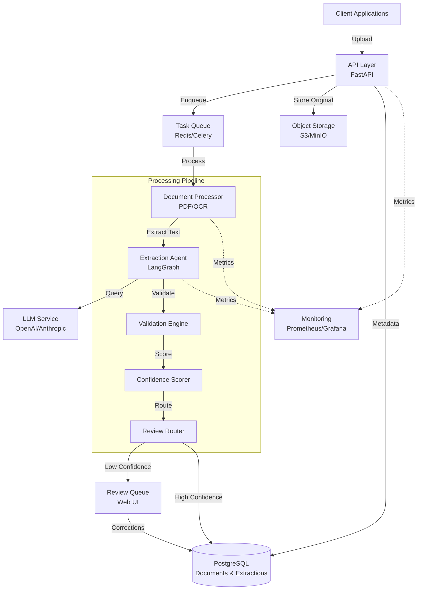
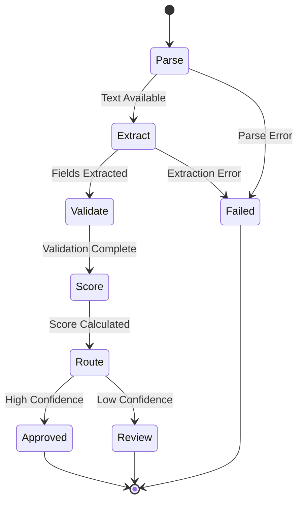

# Design Document: Document Extraction Agent

## Overview

The Document Extraction Agent is an intelligent document processing system that extracts structured data from business documents using AI-powered field extraction with confidence scoring, validation rules, and human-in-the-loop review. The system is designed to process 1,000-100,000 documents per day with sub-2-second p50 latency and 99.9% uptime.

### Key Design Principles

- **Separation of Concerns**: Clean boundaries between API, processing, extraction, validation, and storage layers
- **Scalability**: Horizontal scaling through stateless processing nodes and distributed task queues
- **Reliability**: Fault tolerance through retry mechanisms, graceful degradation, and automated failover
- **Observability**: Comprehensive metrics, structured logging, and distributed tracing
- **Extensibility**: Pluggable document types, extraction schemas, and validation rules

### Architecture Philosophy

The system follows a pipeline architecture where documents flow through distinct processing stages:
1. **Ingestion** → Document upload and validation
2. **Text Extraction** → OCR and PDF parsing
3. **Classification** → Document type detection
4. **Field Extraction** → LLM-based structured data extraction
5. **Validation** → Business rule application
6. **Scoring** → Confidence calculation
7. **Routing** → Auto-approval or human review
8. **Storage** → Persistence and audit trail

Each stage is independently scalable and can fail without compromising the entire system.

## Architecture

### System Architecture Diagram



### Component Architecture


#### 1. API Layer

**Technology**: FastAPI (Python)

**Responsibilities**:
- HTTP request handling and routing
- Request validation and authentication
- Document upload and batch management
- Status queries and result retrieval
- Rate limiting and throttling

**Key Endpoints**:
- `POST /v1/documents/upload` - Single document upload
- `POST /v1/documents/batch` - Batch document upload
- `GET /v1/documents/{id}` - Document status
- `GET /v1/documents/{id}/extraction` - Extraction results
- `GET /v1/batches/{id}/status` - Batch processing status
- `GET /v1/extractions` - Query extractions with filters
- `GET /v1/health` - Service health check

**Scalability**: Stateless design allows horizontal scaling behind load balancer

#### 2. Document Processor

**Technology**: PyMuPDF (PDF), Pillow (images), Tesseract/EasyOCR (OCR)

**Responsibilities**:
- Multi-format document parsing (PDF, JPEG, PNG, TXT)
- Text extraction with position metadata
- Image preprocessing and enhancement
- OCR execution for image-based documents

**Processing Flow**:
```python
if document.format == "PDF":
    text = extract_pdf_text(document)
    if text.is_sparse():  # Image-based PDF
        text = ocr_pdf_pages(document)
elif document.format in ["JPEG", "PNG"]:
    enhanced_image = preprocess_image(document)
    text = ocr_engine.extract(enhanced_image)
elif document.format == "TXT":
    text = read_text_file(document)
```

**Performance Target**: <1s for documents under 10 pages

#### 3. Extraction Agent (LangGraph State Machine)

**Technology**: LangGraph, LangChain

**State Machine Design**:



**State Definitions**:
- **Parse**: Classify document type and load extraction schema
- **Extract**: Use LLM to extract structured fields from text
- **Validate**: Apply business rules to extracted data
- **Score**: Calculate confidence scores for each field
- **Route**: Determine if extraction needs human review

**LLM Integration**:
- Use structured output mode (JSON schema) for reliable extraction
- Prompt engineering with few-shot examples per document type
- Retry logic with exponential backoff for LLM failures
- Fallback to alternative LLM providers if primary fails

**Agent State Schema**:
```python
class ExtractionState:
    document_id: str
    document_text: str
    document_type: Optional[str]
    extraction_schema: Optional[Dict]
    extracted_fields: Dict[str, Any]
    validation_results: List[ValidationResult]
    confidence_scores: Dict[str, float]
    overall_confidence: float
    needs_review: bool
    error: Optional[str]
```

#### 4. Validation Engine

**Technology**: Custom Python validation framework

**Architecture**: Pluggable rule system with rule registry

**Rule Categories**:
- **Format Validation**: Date formats, number formats, regex patterns
- **Range Validation**: Min/max values, date ranges
- **Cross-Field Validation**: Invoice total = sum(line items) + tax
- **Business Logic**: Payment terms validity, PO number format

**Rule Definition Format**:
```python
@validation_rule(name="invoice_total_matches_sum")
def validate_invoice_total(extraction: Dict) -> ValidationResult:
    line_items_total = sum(item['amount'] for item in extraction['line_items'])
    tax = extraction.get('tax_amount', 0)
    total = extraction['total_amount']
    
    calculated_total = line_items_total + tax
    if abs(calculated_total - total) <= 0.01:
        return ValidationResult(passed=True, confidence_boost=0.1)
    else:
        return ValidationResult(
            passed=False, 
            error=f"Total {total} != items {line_items_total} + tax {tax}",
            confidence_penalty=0.2
        )
```

**Extensibility**: Load custom rules from configuration files without code deployment

#### 5. Confidence Scorer

**Technology**: Rule-based scoring algorithm

**Scoring Formula**:
```
field_confidence = base_llm_confidence 
                   + Σ(validation_boost for passed rules)
                   - Σ(validation_penalty for failed rules)
                   
Clamped to [0.0, 1.0]
```

**Base Confidence Sources**:
- LLM logprobs or confidence metadata
- Text extraction quality scores from OCR
- Field value consistency across document

**Confidence Adjustments**:
- +0.1 for each passed validation rule
- -0.2 for each failed validation rule
- -0.3 if field value extracted from low-quality OCR region

**Overall Document Confidence**:
```
overall_confidence = min(field_confidences)  # Conservative approach
```

#### 6. Review Router

**Technology**: Python logic with configurable thresholds

**Routing Logic**:
```python
def should_route_to_review(extraction: ExtractionResult, config: Config) -> bool:
    # Any validation failure triggers review
    if extraction.has_validation_failures():
        return True
    
    # Check field-level confidence
    threshold = config.get_threshold(extraction.document_type)
    for field, confidence in extraction.confidence_scores.items():
        if confidence < threshold:
            return True
    
    # Check overall confidence
    if extraction.overall_confidence < threshold:
        return True
    
    return False
```

**Configuration**: Per-document-type thresholds (e.g., invoices: 0.85, receipts: 0.80)

#### 7. Storage Layer

**Technology**: PostgreSQL with JSONB for flexible schema

**Design Rationale**:
- Structured relational data for documents and extractions
- JSONB for flexible field storage (different schemas per document type)
- Full-text search capabilities on extracted text
- Strong ACID guarantees for audit trail

**High Availability**:
- Primary-replica setup with synchronous replication
- Automatic failover using Patroni or similar
- Connection pooling with PgBouncer
- Regular backups to S3 with point-in-time recovery

#### 8. Object Storage

**Technology**: S3-compatible storage (AWS S3, MinIO)

**Purpose**: Store original document files separately from metadata

**Benefits**:
- Cost-effective storage for large files
- Built-in durability (11 nines)
- Lifecycle policies for archival/deletion
- Pre-signed URL generation for secure access

## Components and Interfaces

### API Contracts

#### Upload Document Request
```json
POST /v1/documents/upload
Content-Type: multipart/form-data

{
  "file": <binary>,
  "document_type": "invoice",  // Optional, auto-detect if omitted
  "metadata": {
    "source": "email",
    "customer_id": "CUST-12345"
  }
}
```

#### Upload Document Response
```json
HTTP 200 OK
{
  "document_id": "doc_a1b2c3d4",
  "status": "queued",
  "estimated_completion_time": "2024-01-15T10:30:45Z"
}
```

#### Get Extraction Results Request
```json
GET /v1/documents/{document_id}/extraction
```

#### Get Extraction Results Response
```json
HTTP 200 OK
{
  "document_id": "doc_a1b2c3d4",
  "status": "completed",
  "document_type": "invoice",
  "extracted_fields": {
    "invoice_number": "INV-2024-001",
    "date": "2024-01-15",
    "vendor_name": "Acme Corp",
    "total_amount": 1250.00,
    "line_items": [
      {"description": "Widget A", "quantity": 10, "unit_price": 100.00, "amount": 1000.00},
      {"description": "Widget B", "quantity": 5, "unit_price": 50.00, "amount": 250.00}
    ],
    "tax_amount": 0.00,
    "payment_terms": "Net 30"
  },
  "confidence_scores": {
    "invoice_number": 0.95,
    "date": 0.92,
    "vendor_name": 0.88,
    "total_amount": 0.97,
    "line_items": 0.90,
    "tax_amount": 0.85,
    "payment_terms": 0.78
  },
  "overall_confidence": 0.78,
  "validation_results": [
    {"rule": "date_format", "passed": true},
    {"rule": "amount_positive", "passed": true},
    {"rule": "invoice_total_matches_sum", "passed": true}
  ],
  "needs_review": false,
  "processing_time_ms": 1850
}
```

#### Batch Upload Request
```json
POST /v1/documents/batch
Content-Type: multipart/form-data

{
  "files": [<binary>, <binary>, ...],  // Up to 100 files
  "document_type": "invoice"  // Optional
}
```

#### Batch Upload Response
```json
HTTP 200 OK
{
  "batch_id": "batch_xyz789",
  "document_count": 50,
  "status": "processing",
  "document_ids": ["doc_a1b2c3d4", "doc_e5f6g7h8", ...]
}
```

#### Query Extractions Request
```json
GET /v1/extractions?document_type=invoice&status=completed&start_date=2024-01-01&end_date=2024-01-31&page=1&page_size=50
```

### Internal Component Interfaces

#### Document Processor Interface
```python
class DocumentProcessor(Protocol):
    def extract_text(self, document: Document) -> TextExtractionResult:
        """Extract text from document with position metadata."""
        
class TextExtractionResult:
    document_id: str
    text: str
    page_count: int
    quality_score: float  # 0.0-1.0
    regions: List[TextRegion]  # Position metadata
    extraction_time_ms: int
    method: str  # "pdf_parse", "ocr_tesseract", "ocr_easyocr"
```

#### Extraction Agent Interface
```python
class ExtractionAgent(Protocol):
    def extract(self, text: str, document_type: str) -> ExtractionResult:
        """Extract structured fields from text using LLM."""
        
class ExtractionResult:
    document_id: str
    document_type: str
    extracted_fields: Dict[str, Any]
    confidence_scores: Dict[str, float]
    overall_confidence: float
    validation_results: List[ValidationResult]
    needs_review: bool
    processing_time_ms: int
```

#### Validation Engine Interface
```python
class ValidationEngine(Protocol):
    def validate(self, extraction: Dict[str, Any], document_type: str) -> List[ValidationResult]:
        """Apply all validation rules for document type."""
        
class ValidationResult:
    rule_name: str
    passed: bool
    error_message: Optional[str]
    confidence_adjustment: float  # Boost or penalty
```

### LangGraph State Machine Implementation

```python
from langgraph.graph import StateGraph, END

def create_extraction_graph() -> StateGraph:
    workflow = StateGraph(ExtractionState)
    
    # Add nodes
    workflow.add_node("parse", parse_document)
    workflow.add_node("extract", extract_fields)
    workflow.add_node("validate", validate_extraction)
    workflow.add_node("score", calculate_confidence)
    workflow.add_node("route", route_decision)
    
    # Add edges
    workflow.set_entry_point("parse")
    workflow.add_edge("parse", "extract")
    workflow.add_edge("extract", "validate")
    workflow.add_edge("validate", "score")
    workflow.add_edge("score", "route")
    
    # Conditional routing
    workflow.add_conditional_edges(
        "route",
        lambda state: "review" if state.needs_review else "approved",
        {
            "review": END,
            "approved": END
        }
    )
    
    return workflow.compile()
```

## Data Models

### Database Schema

#### documents table
```sql
CREATE TABLE documents (
    id UUID PRIMARY KEY DEFAULT gen_random_uuid(),
    created_at TIMESTAMP NOT NULL DEFAULT NOW(),
    updated_at TIMESTAMP NOT NULL DEFAULT NOW(),
    
    -- File metadata
    filename VARCHAR(255) NOT NULL,
    file_size_bytes INTEGER NOT NULL,
    file_format VARCHAR(10) NOT NULL,  -- 'pdf', 'jpeg', 'png', 'txt'
    storage_key VARCHAR(512) NOT NULL,  -- S3 object key
    
    -- Processing metadata
    status VARCHAR(20) NOT NULL,  -- 'queued', 'processing', 'completed', 'failed', 'review'
    document_type VARCHAR(50),  -- 'invoice', 'receipt', 'purchase_order', etc.
    document_type_confidence DECIMAL(3,2),
    
    -- Source metadata (JSONB for flexibility)
    metadata JSONB,
    
    -- Audit
    uploaded_by VARCHAR(100),
    
    INDEX idx_status (status),
    INDEX idx_document_type (document_type),
    INDEX idx_created_at (created_at)
);
```

#### extractions table
```sql
CREATE TABLE extractions (
    id UUID PRIMARY KEY DEFAULT gen_random_uuid(),
    document_id UUID NOT NULL REFERENCES documents(id) ON DELETE CASCADE,
    created_at TIMESTAMP NOT NULL DEFAULT NOW(),
    updated_at TIMESTAMP NOT NULL DEFAULT NOW(),
    
    -- Extracted data (JSONB for flexible schema per document type)
    extracted_fields JSONB NOT NULL,
    
    -- Confidence scores
    field_confidence_scores JSONB NOT NULL,  -- {"invoice_number": 0.95, ...}
    overall_confidence DECIMAL(3,2) NOT NULL,
    
    -- Validation
    validation_results JSONB NOT NULL,  -- [{"rule": "...", "passed": true}, ...]
    validation_passed BOOLEAN NOT NULL,
    
    -- Review status
    needs_review BOOLEAN NOT NULL,
    reviewed_at TIMESTAMP,
    reviewed_by VARCHAR(100),
    review_notes TEXT,
    
    -- Processing metadata
    processing_time_ms INTEGER NOT NULL,
    extraction_method VARCHAR(50) NOT NULL,  -- 'llm_gpt4', 'llm_claude', etc.
    
    -- Version tracking (for corrections)
    version INTEGER NOT NULL DEFAULT 1,
    is_latest BOOLEAN NOT NULL DEFAULT TRUE,
    
    INDEX idx_document_id (document_id),
    INDEX idx_needs_review (needs_review),
    INDEX idx_overall_confidence (overall_confidence),
    INDEX idx_created_at (created_at)
);
```

#### extraction_audit_log table
```sql
CREATE TABLE extraction_audit_log (
    id UUID PRIMARY KEY DEFAULT gen_random_uuid(),
    extraction_id UUID NOT NULL REFERENCES extractions(id) ON DELETE CASCADE,
    created_at TIMESTAMP NOT NULL DEFAULT NOW(),
    
    -- Change tracking
    action VARCHAR(20) NOT NULL,  -- 'created', 'updated', 'reviewed'
    actor VARCHAR(100) NOT NULL,  -- User or system identifier
    
    -- Field-level changes
    field_name VARCHAR(100),
    old_value JSONB,
    new_value JSONB,
    
    -- Context
    change_reason TEXT,
    
    INDEX idx_extraction_id (extraction_id),
    INDEX idx_created_at (created_at)
);
```

#### batches table
```sql
CREATE TABLE batches (
    id UUID PRIMARY KEY DEFAULT gen_random_uuid(),
    created_at TIMESTAMP NOT NULL DEFAULT NOW(),
    updated_at TIMESTAMP NOT NULL DEFAULT NOW(),
    
    -- Batch metadata
    total_documents INTEGER NOT NULL,
    completed_documents INTEGER NOT NULL DEFAULT 0,
    failed_documents INTEGER NOT NULL DEFAULT 0,
    
    -- Status
    status VARCHAR(20) NOT NULL,  -- 'processing', 'completed', 'partial_failure'
    
    -- Audit
    uploaded_by VARCHAR(100),
    
    INDEX idx_status (status),
    INDEX idx_created_at (created_at)
);

CREATE TABLE batch_documents (
    batch_id UUID NOT NULL REFERENCES batches(id) ON DELETE CASCADE,
    document_id UUID NOT NULL REFERENCES documents(id) ON DELETE CASCADE,
    
    PRIMARY KEY (batch_id, document_id),
    INDEX idx_batch_id (batch_id)
);
```

### Extraction Schema Format

Extraction schemas define what fields to extract for each document type:

```json
{
  "document_type": "invoice",
  "version": "1.0",
  "fields": [
    {
      "name": "invoice_number",
      "type": "string",
      "required": true,
      "description": "Unique invoice identifier",
      "validation_rules": ["not_empty", "alphanumeric_with_dash"]
    },
    {
      "name": "date",
      "type": "date",
      "required": true,
      "description": "Invoice date",
      "validation_rules": ["date_format_iso8601", "date_not_future"]
    },
    {
      "name": "vendor_name",
      "type": "string",
      "required": true,
      "description": "Name of the vendor/seller"
    },
    {
      "name": "total_amount",
      "type": "decimal",
      "required": true,
      "description": "Total invoice amount",
      "validation_rules": ["positive_number", "max_2_decimals"]
    },
    {
      "name": "line_items",
      "type": "array",
      "required": true,
      "description": "Individual line items",
      "item_schema": {
        "description": {"type": "string"},
        "quantity": {"type": "integer", "validation_rules": ["positive"]},
        "unit_price": {"type": "decimal", "validation_rules": ["positive"]},
        "amount": {"type": "decimal", "validation_rules": ["positive"]}
      }
    },
    {
      "name": "tax_amount",
      "type": "decimal",
      "required": false,
      "description": "Tax amount"
    },
    {
      "name": "payment_terms",
      "type": "string",
      "required": false,
      "description": "Payment terms (e.g., Net 30)"
    }
  ],
  "cross_field_validations": [
    {
      "name": "total_matches_sum",
      "rule": "total_amount == sum(line_items.amount) + tax_amount",
      "tolerance": 0.01
    }
  ]
}
```

### LLM Prompt Template

```python
EXTRACTION_PROMPT_TEMPLATE = """
You are an expert at extracting structured data from business documents.

Document Type: {document_type}
Document Text:
{document_text}

Extract the following fields and return them as JSON:
{field_descriptions}

Rules:
- Extract exact values as they appear in the document
- For dates, use ISO 8601 format (YYYY-MM-DD)
- For amounts, include only numeric values (no currency symbols)
- If a field is not found, use null
- For line items, extract all items in an array

Return only valid JSON with no additional text.

Example output format:
{example_output}
"""
```


## Correctness Properties

*A property is a characteristic or behavior that should hold true across all valid executions of a system—essentially, a formal statement about what the system should do. Properties serve as the bridge between human-readable specifications and machine-verifiable correctness guarantees.*

### Property 1: Supported Format Acceptance

*For any* document in PDF, JPEG, PNG, or TXT format with size ≤50MB, the API Layer should accept the upload and return a unique document identifier.

**Validates: Requirements 1.1, 1.2, 1.4**

### Property 2: Document Persistence Completeness

*For any* uploaded document, after successful upload, querying the Storage Layer should return the document with all metadata fields populated (upload timestamp, file size, format, status).

**Validates: Requirements 1.5, 9.1**

### Property 3: Batch Size Acceptance

*For any* batch of documents where 1 ≤ batch_size ≤ 100, the API Layer should accept the batch and return a valid batch identifier.

**Validates: Requirements 1.6, 8.3**

### Property 4: Document Type Classification

*For any* ingested document, after processing, the document should have a document_type field assigned with a classification confidence score.

**Validates: Requirements 2.1, 2.4**

### Property 5: Low Confidence Type Routing

*For any* document with classification confidence <0.7, the system should mark the document for manual type selection.

**Validates: Requirements 2.3**

### Property 6: Text Extraction Completeness

*For any* PDF or image document containing text, the Document Processor should extract text content and include position metadata for each text region.

**Validates: Requirements 3.1, 3.2, 3.4**

### Property 7: Extraction Failure Handling

*For any* document where text extraction fails, the system should mark the document status as 'failed' and create an error log entry.

**Validates: Requirements 3.3**

### Property 8: Schema Application

*For any* document with a classified document_type, the Extraction Agent should apply the extraction schema corresponding to that type, attempting to extract all schema-defined fields.

**Validates: Requirements 4.1, 4.5**

### Property 9: JSON Output Validity

*For any* completed extraction, the output should be valid JSON containing all fields defined in the extraction schema (with null for missing values).

**Validates: Requirements 4.5**

### Property 10: Confidence Score Range

*For any* extracted field, the confidence score should be a numeric value in the range [0.0, 1.0].

**Validates: Requirements 5.1**

### Property 11: Validation Impact on Confidence

*For any* extraction with validation rules applied, passing validation rules should result in a confidence score ≥ the base score, and failing validation rules should result in a confidence score < the base score.

**Validates: Requirements 5.3, 5.4**

### Property 12: Confidence Score Persistence

*For any* extraction, querying the stored extraction should return individual field confidence scores for all extracted fields.

**Validates: Requirements 5.5**

### Property 13: Validation Rule Execution

*For any* document type with configured business rules, all rules for that type should be executed during validation, with results recorded.

**Validates: Requirements 6.1**

### Property 14: Field Format Validation

*For any* date field, the validation engine should verify it matches expected date patterns, and *for any* amount field, the validation engine should verify it is a positive number with proper decimal precision.

**Validates: Requirements 6.2, 6.3**

### Property 15: Invoice Total Validation

*For any* invoice extraction, if line_items and tax_amount are extracted, the validation engine should verify that |total_amount - (sum(line_items.amount) + tax_amount)| ≤ 0.01.

**Validates: Requirements 6.4**

### Property 16: Validation Failure Recording

*For any* business rule that fails during validation, the system should create a validation result record containing the rule name and specific violation description.

**Validates: Requirements 6.5**

### Property 17: Custom Rule Execution

*For any* custom validation rule defined in configuration, the validation engine should execute it against extracted data with the same behavior as built-in rules.

**Validates: Requirements 6.6**

### Property 18: Review Routing Logic

*For any* extraction where (1) any field confidence score is below the configured threshold OR (2) any validation rule fails, the system should route the extraction to the Review Queue.

**Validates: Requirements 7.1, 7.2**

### Property 19: Review Correction Persistence

*For any* extraction where a reviewer makes field corrections, querying the extraction history should return both the original extracted values and the corrected values.

**Validates: Requirements 7.4**

### Property 20: Review Approval Status

*For any* extraction that a reviewer approves, the extraction record should be marked with status 'verified' and include reviewer identity and approval timestamp.

**Validates: Requirements 7.5**

### Property 21: Review Queue Filtering

*For any* query to the Review Queue with filters (document_type, confidence_range, validation_status), all returned extractions should match the specified filter criteria.

**Validates: Requirements 7.6**

### Property 22: Batch Processing Status Accuracy

*For any* batch, querying the batch status should return counts where completed_count + failed_count + in_progress_count = total_document_count.

**Validates: Requirements 8.4**

### Property 23: Batch Fault Isolation

*For any* batch where one document fails processing, all other documents in the batch should continue processing to completion or independent failure.

**Validates: Requirements 8.5**

### Property 24: Audit Trail Creation

*For any* modification to extraction data, the system should create an audit log entry containing timestamp, actor identity, field name, old value, and new value.

**Validates: Requirements 9.2, 13.5**

### Property 25: Extraction History Completeness

*For any* document with multiple extraction versions, querying extraction history should return all versions in chronological order with all modification details and reviewer identities.

**Validates: Requirements 9.5**

### Property 26: Extraction Retrieval by ID

*For any* document with completed extraction, querying by document_id should return the extraction with all extracted fields, confidence scores, and validation results.

**Validates: Requirements 10.1**

### Property 27: Filtered Extraction Queries

*For any* query with filters (date range, document_type, status), all returned extractions should have values matching all specified filter criteria.

**Validates: Requirements 10.2**

### Property 28: Multi-Format Export Validity

*For any* extraction result, exporting in JSON, CSV, or XML format should produce valid output in the target format containing all extracted field data.

**Validates: Requirements 10.4**

### Property 29: Pagination Correctness

*For any* query with pagination parameters (page number, page size), the returned results should contain exactly page_size items (or fewer for the last page), and concatenating all pages should yield the complete result set without duplicates.

**Validates: Requirements 10.5**

### Property 30: Component Failure Logging

*For any* component failure during processing, the system should create a log entry containing the error details and emit an alert to the monitoring system.

**Validates: Requirements 11.2**

### Property 31: PII Encryption at Rest

*For any* document or extraction containing PII fields, querying the raw storage should show the PII data encrypted using AES-256.

**Validates: Requirements 13.1, 13.4**

### Property 32: Authentication Requirement

*For any* API request without a valid authentication token, the API Layer should reject the request with a 401 Unauthorized status.

**Validates: Requirements 13.2**

### Property 33: PII Redaction in Logs

*For any* system where PII redaction is configured, log entries containing PII fields should show masked values (e.g., "***") instead of actual sensitive data.

**Validates: Requirements 13.6**

### Property 34: Custom Schema Loading

*For any* custom Extraction_Schema added to configuration, the Extraction Agent should load the schema and use it for documents matching that document type.

**Validates: Requirements 14.1**

### Property 35: Custom Validation Rule Loading

*For any* custom business rule added to configuration, the Validation Engine should load and execute the rule against extracted data.

**Validates: Requirements 14.2**

### Property 36: Per-Type Confidence Thresholds

*For any* document type with a configured confidence threshold, the review routing logic should use that type-specific threshold rather than a global default.

**Validates: Requirements 14.3**

### Property 37: OCR Engine Configuration

*For any* system configured to use a specific OCR engine (Tesseract or EasyOCR), image documents should be processed using the configured engine.

**Validates: Requirements 14.4**

### Property 38: Configuration Hot Reload

*For any* configuration update (schema, rule, threshold), the system should apply the new configuration to subsequent requests without requiring a service restart.

**Validates: Requirements 14.5**

### Property 39: OCR Text Region Detection

*For any* image document with visible text, the OCR Engine should detect at least one text region and extract text with character-level confidence scores.

**Validates: Requirements 15.1, 15.2**

### Property 40: Low Quality Image Preprocessing

*For any* image with quality below 150 DPI equivalent, the OCR Engine should apply image enhancement preprocessing before text extraction.

**Validates: Requirements 15.3**

### Property 41: OCR Failure Error Reporting

*For any* image where OCR processing fails, the OCR Engine should return an error message indicating the failure reason (poor quality or unsupported content).

**Validates: Requirements 15.5**

### Property 42: Schema Parsing Validity

*For any* syntactically valid Extraction_Schema file, the Schema Parser should successfully parse it into an internal schema object with all field definitions preserved.

**Validates: Requirements 16.1**

### Property 43: Schema Parsing Error Messages

*For any* invalid Extraction_Schema file, the Schema Parser should return error messages indicating the specific location (line/field) and nature of each validation error.

**Validates: Requirements 16.2**

### Property 44: Schema Round-Trip Property

*For any* valid schema object, parsing → printing → parsing should produce an object equivalent to the original (idempotent serialization).

**Validates: Requirements 16.4**

### Property 45: Schema Required Field Validation

*For any* Extraction_Schema missing required fields (field_name, field_type, or validation_rules), the Schema Parser should reject it with a descriptive error.

**Validates: Requirements 16.5**

### Property 46: Metrics Exposure

*For any* system actively processing documents, querying the metrics endpoint should return current values for processing rate, latency percentiles, error rate, review queue depth, and confidence score distributions by document type.

**Validates: Requirements 17.1, 17.2, 17.3**

### Property 47: Health Check Status

*For any* system state, the health check endpoint should return service status (healthy/degraded/unhealthy) and the health status of all dependencies (database, LLM service, storage).

**Validates: Requirements 17.4**

### Property 48: Structured Error Logging

*For any* error during request processing, the system should emit a structured log entry containing error details, stack trace, and a correlation ID that traces the request across all components.

**Validates: Requirements 17.5**


## Error Handling

### Error Categories

The system handles errors across multiple categories with appropriate recovery strategies:

#### 1. Client Errors (4xx)

**Invalid Input**
- **400 Bad Request**: Malformed request, missing required fields
- **413 Payload Too Large**: Document exceeds 50MB limit
- **415 Unsupported Media Type**: Invalid document format
- **422 Unprocessable Entity**: Valid format but invalid content

**Authentication/Authorization**
- **401 Unauthorized**: Missing or invalid authentication token
- **403 Forbidden**: Authenticated but insufficient permissions

**Resource Errors**
- **404 Not Found**: Document ID does not exist
- **409 Conflict**: Duplicate document upload

#### 2. Server Errors (5xx)

**Service Errors**
- **500 Internal Server Error**: Unexpected processing failure
- **503 Service Unavailable**: System overload or dependency failure
- **504 Gateway Timeout**: LLM or external service timeout

**Response Format**:
```json
{
  "error": {
    "code": "EXTRACTION_FAILED",
    "message": "Failed to extract text from document",
    "details": "OCR engine reported poor image quality",
    "document_id": "doc_a1b2c3d4",
    "correlation_id": "req_xyz789",
    "timestamp": "2024-01-15T10:30:45Z"
  }
}
```

### Error Recovery Strategies

#### Transient Failures

**LLM Service Failures**
- Retry with exponential backoff (100ms, 200ms, 400ms, 800ms)
- Maximum 3 retry attempts
- Fallback to alternative LLM provider after retries exhausted
- Circuit breaker pattern to prevent cascade failures

**Database Connection Failures**
- Automatic connection pool retry
- Failover to replica database
- Transaction rollback and retry for serialization errors

**Storage Service Failures**
- Retry S3/storage operations with exponential backoff
- Local disk buffer for temporary storage during outages

#### Permanent Failures

**Document Processing Failures**
- Mark document status as 'failed'
- Record detailed error in audit log
- Notify monitoring system
- Allow manual retry via API endpoint

**Validation Failures**
- Route to human review queue
- Do not block processing pipeline
- Record specific validation failures for correction

**Extraction Failures**
- Fall back to manual data entry workflow
- Record partial extraction if any fields succeeded
- Preserve original document for manual processing

### Graceful Degradation

**LLM Service Unavailable**
- Queue documents for later processing
- Return 202 Accepted with estimated completion time
- Process queue when service recovers

**High Load Conditions**
- Return 503 with Retry-After header
- Implement request rate limiting per client
- Shed non-critical requests (analytics, metrics queries)

**Partial System Failure**
- Continue processing with reduced functionality
- Health check returns 'degraded' status
- Log degradation event for monitoring

### Error Monitoring and Alerting

**Critical Alerts** (Immediate notification)
- Database failover events
- LLM service completely unavailable >5 minutes
- Error rate >5% sustained for >2 minutes
- Queue depth >1000 documents

**Warning Alerts** (Notification within 15 minutes)
- Individual component errors
- Elevated latency (p99 >10s)
- Review queue depth >100

**Metrics Tracked**
- Error rate by error type
- Retry success rate
- Circuit breaker state changes
- Failure recovery time


## Testing Strategy

### Testing Approach

The system employs a comprehensive testing strategy combining unit tests, property-based tests, integration tests, and end-to-end tests. This multi-layered approach ensures both correctness of individual components and proper system-wide behavior.

### Unit Testing

**Scope**: Individual functions and methods in isolation

**Focus Areas**:
- Input validation logic
- Error handling for specific edge cases
- Business rule implementations
- Data model serialization/deserialization
- API request/response formatting

**Example Test Cases**:
- Date format validation with specific invalid formats
- Amount field validation with negative values, zero, and boundary values
- Invoice total calculation with edge cases (empty line items, missing tax)
- Document type classification with ambiguous documents
- Error response formatting for various error types

**Test Framework**: pytest (Python)

**Coverage Target**: >80% code coverage for all components

### Property-Based Testing

**Scope**: Universal properties that should hold across all inputs

**Framework**: Hypothesis (Python)

**Configuration**: Minimum 100 iterations per property test

**Tagging Convention**: Each property test must include a comment tag:
```python
# Feature: document-extraction-agent, Property 1: Supported Format Acceptance
@given(document=valid_documents(), size=integers(min_value=1, max_value=50*1024*1024))
def test_supported_format_acceptance(document, size):
    """For any document in supported format with size ≤50MB, API should accept upload."""
    response = api.upload_document(document, size)
    assert response.status_code == 200
    assert response.document_id is not None
    assert is_valid_uuid(response.document_id)
```

**Key Property Tests** (mapping to design properties):

1. **Property 1-3**: Upload and batch acceptance with random valid inputs
2. **Property 8-9**: Schema application and JSON output validity with generated documents
3. **Property 10-12**: Confidence scoring behavior with random extractions and validation results
4. **Property 14-17**: Validation rule execution with generated field values
5. **Property 18**: Review routing with random confidence scores and validation states
6. **Property 21, 27**: Query filtering with random filter combinations
7. **Property 29**: Pagination with random page sizes and data sets
8. **Property 44**: Schema round-trip with randomly generated valid schemas

**Generator Strategies**:
```python
@composite
def valid_documents(draw):
    """Generate valid documents in supported formats."""
    format = draw(sampled_from(['pdf', 'jpeg', 'png', 'txt']))
    size = draw(integers(min_value=100, max_value=50*1024*1024))
    content = draw(text(min_size=10, alphabet=string.printable))
    return Document(format=format, size=size, content=content)

@composite
def invoice_extractions(draw):
    """Generate valid invoice extractions."""
    line_items = draw(lists(
        fixed_dictionaries({
            'description': text(min_size=1),
            'quantity': integers(min_value=1, max_value=1000),
            'unit_price': decimals(min_value=0.01, max_value=10000, places=2),
            'amount': just(None)  # Will be calculated
        }),
        min_size=1,
        max_size=20
    ))
    # Calculate amounts to ensure validation passes
    for item in line_items:
        item['amount'] = item['quantity'] * item['unit_price']
    
    tax = draw(decimals(min_value=0, max_value=1000, places=2))
    total = sum(item['amount'] for item in line_items) + tax
    
    return {
        'invoice_number': draw(text(min_size=5, max_size=20)),
        'date': draw(dates(min_value=date(2020, 1, 1))).isoformat(),
        'vendor_name': draw(text(min_size=3, max_size=100)),
        'total_amount': total,
        'line_items': line_items,
        'tax_amount': tax,
        'payment_terms': draw(sampled_from(['Net 30', 'Net 60', 'Due on Receipt']))
    }
```

**Edge Case Generators**:
- Empty collections (empty line items, empty batches)
- Boundary values (0, max integers, max decimals)
- Special characters in text fields
- Unicode and non-ASCII characters
- Malformed but parseable input

### Integration Testing

**Scope**: Component interactions and data flow between services

**Focus Areas**:
- API → Queue → Processor pipeline
- Extraction Agent state machine transitions
- Database persistence and retrieval
- LLM service integration with mocking
- Review queue routing logic

**Test Environment**:
- Docker Compose with all services
- Test database with isolated schema
- Mock LLM service for deterministic responses
- LocalStack for S3 emulation

**Example Integration Tests**:
- End-to-end document upload → extraction → storage → retrieval flow
- Batch processing with mixed success/failure documents
- Review queue routing with various confidence scenarios
- Configuration reload without service restart
- Database failover and recovery

### End-to-End Testing

**Scope**: Complete user workflows from API to final output

**Test Scenarios**:
1. **Happy Path**: Upload invoice → auto-extraction → validation passes → approved → retrieve results
2. **Low Confidence**: Upload receipt → extraction → low confidence → routed to review → manual correction → approved
3. **Validation Failure**: Upload invoice → extraction → total mismatch → routed to review → corrected → approved
4. **Batch Processing**: Upload 50 documents → track status → all complete → query results
5. **Error Recovery**: Upload corrupt PDF → extraction fails → error logged → manual retry → success

**Performance Testing** (separate from functional tests):
- Load testing with JMeter or Locust
- Latency verification (p50 <2s, p99 <5s)
- Throughput verification (100 docs/min per node)
- Stress testing to find breaking points
- Soak testing for memory leaks

### Test Data Strategy

**Synthetic Data Generation**:
- Generate realistic invoices, receipts, POs using templates
- Vary layouts, fonts, and formats to test robustness
- Include intentional errors for validation testing

**Anonymized Production Data** (if available):
- Scrub all PII before use in tests
- Maintain representative distribution of document types
- Include known edge cases from production issues

**Test Fixtures**:
- Curated set of documents covering all supported types
- Known-good and known-bad examples for validation
- Edge cases (minimal content, maximal content, special characters)

### Continuous Integration

**CI Pipeline**:
1. Lint and format checks (black, flake8, mypy)
2. Unit tests with coverage reporting
3. Property-based tests (100 iterations, fast mode)
4. Integration tests with Docker Compose
5. Build Docker images
6. Security scanning (Snyk, Trivy)

**Nightly Extended Testing**:
- Property-based tests with 10,000 iterations
- End-to-end performance tests
- Long-running soak tests (4 hours)
- Full security audit

**Pre-Production Testing**:
- Smoke tests on staging environment
- Canary deployment with 5% traffic
- Monitor error rates and latency
- Full rollout after 24 hours of stable canary

### Test Maintenance

**Property Test Debugging**:
- When property test fails, Hypothesis provides minimal failing example
- Add failing example as regression unit test
- Fix bug, verify property passes
- Keep minimal example in test suite

**Flaky Test Management**:
- Track test flakiness rates
- Quarantine tests with >5% flake rate
- Add explicit waits and deterministic setup
- Remove or rewrite persistently flaky tests

**Test Documentation**:
- Each property test includes docstring explaining the property
- Integration tests document the workflow being tested
- Test data fixtures include comments explaining purpose

